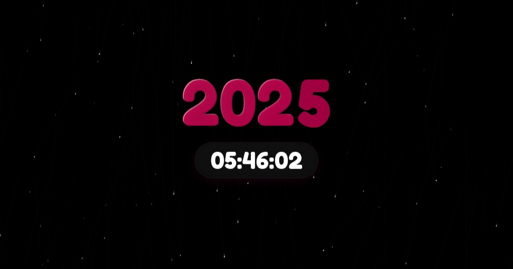

# 🎉 New Year Countdown

A festive web app that celebrates the arrival of the New Year with a live countdown, fireworks, snowfall, and a smooth year‑digit animation.  
This project was built to bring joy and a little digital celebration as the clock strikes midnight.

---

## ✨ Features
- ⏳ **Countdown Timer** — counts down to January 1st at midnight.
- 🔢 **Year Digit Animation** — last digit scrolls up (e.g. 2025 → 2026).
- 🎆 **Fireworks Show** — runs for 60 seconds starting exactly at midnight.
- ❄️ **Snowfall Effect** — light, subtle snowflakes that respond to device tilt.
- 🥳 **Hidden Easter Egg** — press `Ctrl + Shift + D` to reveal a footer credit.

---

## 📂 Project Structure

index.html       # Main HTML file style.css        # Styling and animations script.js        # Countdown, fireworks, and snow logic screenshot.png   # Demo screenshot for README README.md        # Project description


---

## 📸 Screenshot


---

## 🚀 Getting Started
1. Clone the repository:
   ```bash
   git clone https://github.com/asikrshoudo/new-year-countdown.git

